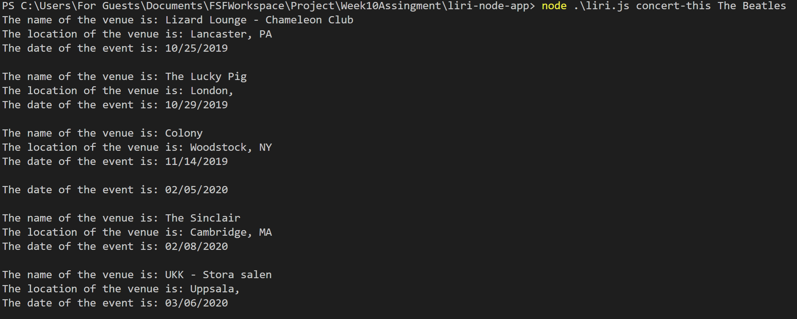
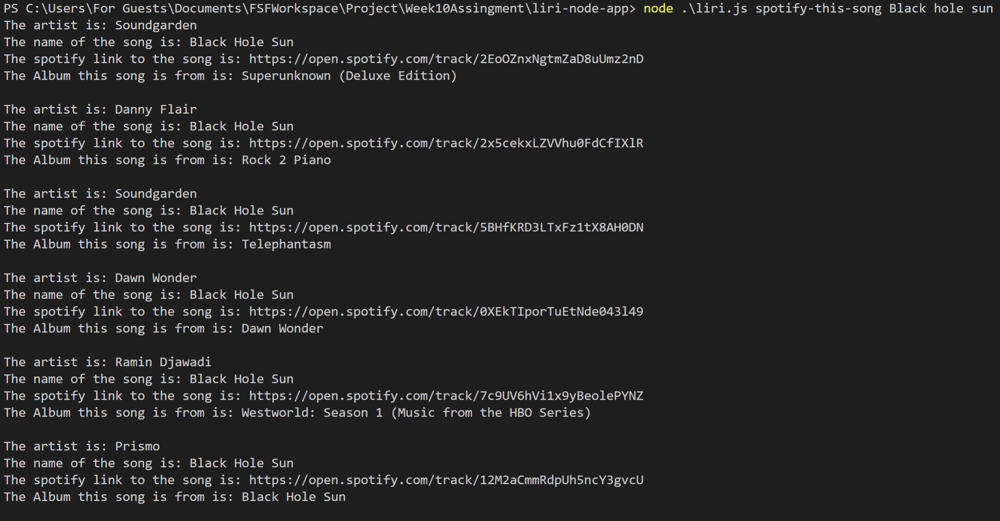
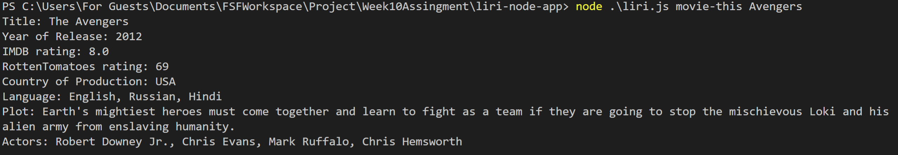
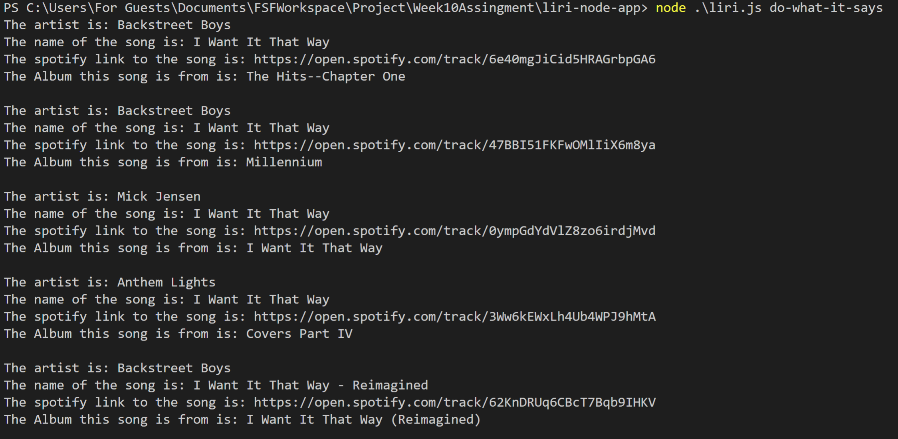

# liri-node-app

Problem: The problem the app is trying to solve is, that it is hard to look up concerts for groups, movie information, or spotify links for songs. This allows the user to do so easier.

Overview: The app is organized with most of the actual functionality contained in functions. That will only be called when the if statements at the end of the app are deemed true, with the fourth command being a bit special in that it can call any of the functions depending on what is written in random.txt.

Instructions: start by doing "node liri.js" then depending on what action you want to do, type "concert-this" followed by a band name or artist, this will show their upcoming events by location and date. Next command is "spotify-this-song" followed by a song name, this will give you the artist, song name, link to spotify, and the album it is from. Third command is "movie-this" followed by a movie name, this will show the title of the movie, release year, IMDB rating, Metascore, country of production, language of movie, plot, and actors. The final command is "do-what-it-says" which will read in the text from random.txt and will follow the command written in there.

Images: 

Git Link: https://github.com/JamesConry/liri-node-app

Notable Technologies used: Node was a major technology used in this, as well as axios, and various api's to get the information.

Role: Complete creation of app.
